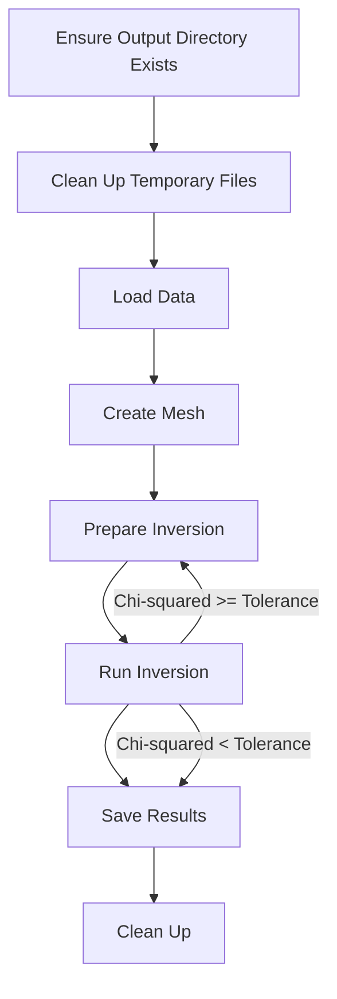

# Overview

This `ERT_Main.py` script performs Electrical Resistivity Tomography (ERT) inversion using the PyGimli library. It processes electrical data file (processed from data processing), creates a mesh, runs an inversion algorithm, and generates visual results in a figure. The script also manages temporary files and ensures that the output is properly saved.

# Workflow

1. Setup Directories:

- Ensure that an output directory exists where results will be saved.
- Clean up any existing temporary files that match specific patterns.

2. Load Data:

- Retrieve the first raw data file from the Raw directory.

3. Create Mesh:

- Define a geometric region and generate a mesh for the inversion process.

4. Prepare Inversion:

- Load the ERT data and preprocess it by filtering negative values and adding error estimates.

5. Run Inversion:

- Perform the iteration of processing the inversion and calculate the chi-squared value.
- Check if it is lower than the set tolerance.

6. Save Results:

- Store the inversion results and generate a plot showing the result.
- Save the plot as a `.PNG` file in the output directory.

7. Clean Up:

- Remove temporary files that are no longer needed.

# Function explannation

- `ensure_output_folder()`: Check if there have a folder named `Output`. If it doesn't exist, then create a new one and return `Output` folder.

- `cleanup_temp_files()`: delete temperary files (those files match the pre-defined mode). This function will match the specific file mode such as `.vector`, `.matrix`,`.bmat` etc, then trying to delete it. If there are any errors happend during the deleting process, it will catch errors and print error message.

- `get_first_raw_file()`
  Retrieves the first file from the Raw directory. Raises an exception if no files are found.

- `create_mesh(start, end, quality, area)`
  Creates a geometric mesh for the inversion process. Saves the mesh to a file and returns the mesh object.

- `startInversion(maxIter, lam, dPhi, start, end, quality, area)`
  Coordinates the entire ERT inversion process. Loads data, prepares inversion parameters, performs the inversion, and saves the results. Also generates and saves a plot of the inversion result.

# Display

# Conclusion

# Reference
