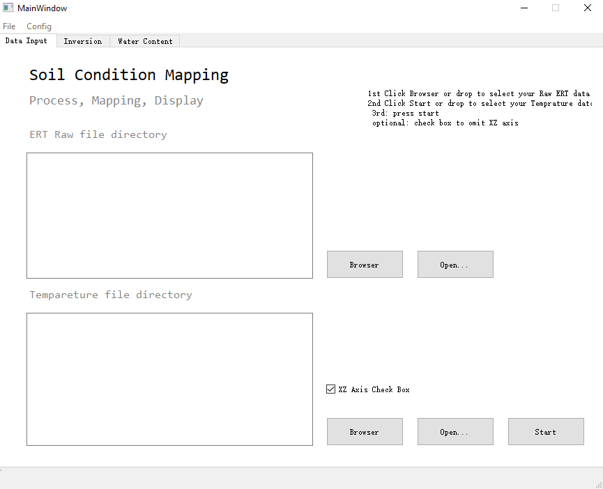
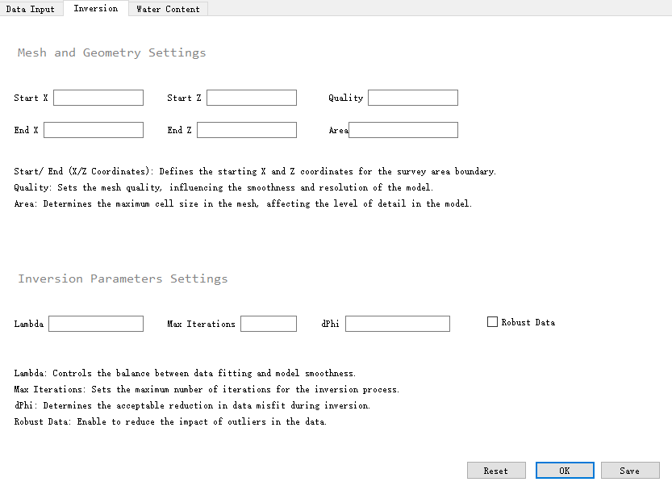
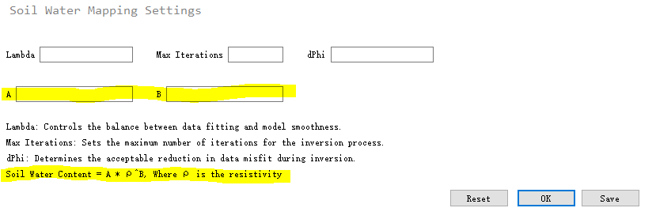

# Soil Condition Inversion Mapping 

## Overview 

This project is part of the **CITS5206** course and focuses on soil condition mapping using inversion techniques. The project utilizes the **PyGIMLi** library for geophysical inversion and **PyQt5** for the user interface. The environment is managed with Conda to ensure cross-platform compatibility and automation via CI. Please note that this project is designed to run on **Windows** but also supports **macOS** and **Linux**.

## Prerequisites <!-- This is a subheading -->

- **Operating System**:
  - Windows (primary)
  - macOS (optional)
  = Linux (optional) 
- **Python Distribution**: Anaconda3
- **Libraries**(handled via Conda environment): 
  - Python 3.10
  - PyGIMLi >= 1.5.0
  - SuiteSparse = 5
  - PyQt5
  - Pandas
  - Matplotlib
  - Numpy
  - pytest

## Installation Instructions 

Follow the steps below to set up your environment and get started with the project.

### Step 1: Install Anaconda and Python3

1. Download and install [Anaconda3](https://www.anaconda.com/products/distribution#download-section). <!-- This is a numbered list -->
2. Ensure Python 3 is installed with Anaconda.

### Step 2: Create a Virtual Environment

1. Open the **Anaconda Prompt**.
2. Create a new virtual environment named `pg` with the required libraries by executing the following command:

   ```bash
   conda create -n pg -c gimli -c conda-forge python=3.10 pygimli>=1.5.0 suitesparse=5
   ```
3. Activate virtual environment using code below after successfully installed the virtual environment.
   
    ```bash
   conda activate pg
    ```

### Step 3: Install libraries

1. Install additional compulsory dependencies like **Pandas**, **Matplotlib**, **Numpy**, and optionally **pytest**:
    ```bash
   conda install pandas matplotlib numpy pytest
    ```
2. Install PyQt5 if not included by default:
   ```bash
   conda install pyqt
   ```
### Step 4: Run the Python script

1.  Run main.py in the project using terminal or preset IDEs.

### Step 5: Testing (Optional)

To run automated tests with `pytest`:
```bash
pytest
```

## How to use
- Run main.py with anaconda environment and all prerequisites installed.
- This will navigate you to a UI, you can select files from the navigation or from the UI.
- There are clear instructions in each tab.

1. On Data Input page
- Press start on Data Input page for data processing.
- Open for opening designated file location, and the directory will be print inside the box once files are selected.
- There are 2 kind of files need to be selected: ERT Raw file and Tempareture file.
2. On Inversion page
- Enter the input field for inversion output, press save to save the input and press reset for default input.
- Press OK will navigate to a file selection dialog, select your input file (processed ERT file).
- Your output will be displayed after processing

3. On Water Content page 
- Same as the Inversion with 2 extra input fields.
- **Your inputs from inversion will be saved, write in the input fields if you want to use other parameters**


# Data Processing Workflow for tx0_to_txt_temp Pipeline


## 1. Run ```tx0_to_txt_offset.py```


  - **Input**: `tx0_files` folder
  - **Output**: `output_txt_offset` folder
  - The measured data is stored in the tx0_files folder inside the tx0_txt_tmp directory. The original .tx0 file structure is very complex, containing records of electrode positions, measurement data, and other configuration details. The purpose of this step is to simplify the complex content of the .tx0 files into a more structured and clearer data format through the Python script, removing unnecessary metadata and configuration details, and extracting the required data: Electrode positions (x, z) and Measurement data (a, b, m, n, rhoa, x, z).


```python
python tx0_to_txt_offset.py tx0_files/ output_txt_offset/


```


## 2. Run ```Newtem.py```


  - **Input**: `output_txt_offset` folder and `GNtemp.txt` file
  - **Output**: `Newtem.txt`
  - The GNtemp.txt file contains temperature data, with each row representing temperature readings at different depths. The purpose of this step is to filter GNtemp.txt based on the dates extracted from the filenames of the processed .txt files in the output_txt_offset folder.


```python
python Newtem.py output_txt_offset/ GNtemp.txt


```


## 3. Run ```txt_temp.py```


  - **Input**: `output_txt_offset` folder and `Newtem.txt` file
  - **Output**: `tx0_to_txt_temp` folder
This step processes the data files by applying temperature calibration to resistivity measurements based on the depth, using temperature data from Newtem.txt, and outputs both detailed and simplified corrected resistivity data.


```python
python txt_temp.py Newtem.txt output_txt_offset/
```


## 4. Run ```auto_tx0_txt_temp.py``` to automate the above process.


  - **Input**: `tx0_files` folder and  `GNtemp.txt` file
  - **Output**: `tx0_to_txt_temp` folder


```python
python auto_tx0_txt_temp.py
```

## 5. Math formula 
This formula can be expressed mathematically as:<br />
ρ_corrected = ρ_measured * [1 + α(T - T_ref)]<br />
Where:<br />
ρ_corrected is the corrected resistivity<br />
ρ_measured is the measured resistivity<br />
α is the temperature coefficient (0.025 /°C in this formula)<br />
T is the actual temperature<br />
T_ref is the reference temperature (25°C in this formula)<br />
The specific formula used in the code is:<br />
ρ_corrected = ρ_measured * [1 + 0.025(T - 25)]<br />


This formula accounts for the effect of temperature on resistivity, allowing the measured resistivity to be corrected to a standard temperature (25°C in this case). The temperature coefficient of 0.025 /°C indicates that for every 1°C deviation from the reference temperature, the resistivity changes by 2.5%.

# Temperature vs Depth Visualization 

This Python tool processes temperature data from `.tx0` files based on specific date and time extracted from the filename. It then visualizes the temperature at various depths using a customized plot.

## Table of Contents

1. [Description](#description)
2. [Installation](#installation)


## Description

This tool extracts temperature data from a `.tx0` file (`GNtemp.txt`) for a specific date and time based on filenames that include date and time in various formats. It allows users to visualize the temperature variation with depth using a well-formatted plot.

### Input:
- Filenames containing date and time (formats: `YYYY-MM-DD_HH-MM-SS`, `YYYY-MM-DD`, `DD_MM_YYYY`, or `YYYY_MM_DD`).
- Temperature data stored in a `.txt` file (`GNtemp.txt`), where each row represents temperature readings at different depths and times.

### Output:
- A plot showing the relationship between temperature and depth for a given date and time.

## Installation

Make sure you have Python and the necessary libraries installed:

```bash
pip install pandas matplotlib
```


# Trouble Shooting

### Alternative Flow 1 Set System Environment Variables (If using Windows)
If you're using an IDE that does not automatically integrate with Anaconda (such as PyCharm or others), you may need to manually configure your system environment variables or using **Anaconda Navigator** to launch your IDEs.  
If you want to change system environment variables: 
1. Open the System Properties:
- Right-click on This PC or My Computer and select Properties.
- Click on Advanced system settings.
- Click on Environment Variables.
2. Modify the Path variable in the System variables section:
- Click Edit.
- Add the following paths to the list if Anaconda is installed under C:\
- {Your install location}\Anaconda3
- {Your install location}\Anaconda3\Scripts
- {Your install location}\Anaconda3\condabin
- Replace **Your install location**.
3. Click OK to close all dialogs.

### Alternative Flow 2 Configure IDE to Use Anaconda Environment
1. Open any Python file in Visual Studio Code.
2. Find Python Interpreter or press Ctrl + Shift + P to open the Command Palette If you are using VS Code.
3. Type or select Python: Select Interpreter.
4. Choose the Anaconda environment pg from the list.

# Credits
This software is built on previous work from repository [Soil-Conditions](https://github.com/wintelestr/Soil-Conditions)  
The solution to cross-platfrom is contributed by [pyGimli](https://github.com/gimli-org/gimli/issues/761)
