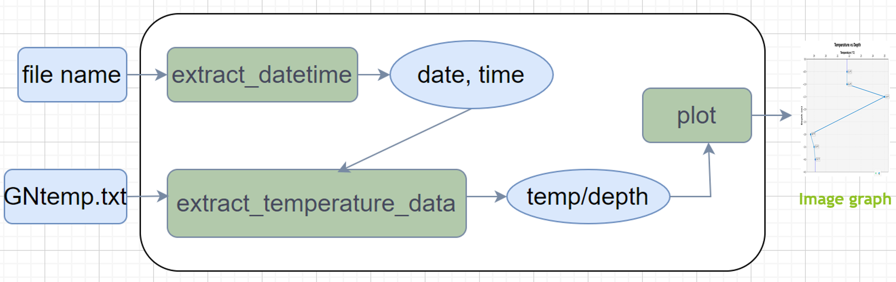
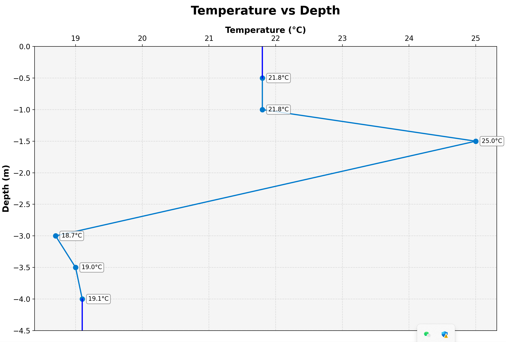

# User Manual for temp vs depth
## 1. Overview
`This module processes soil temperature data, extracting information from specific file formats and generating visual representations of temperature variations across different depths.`

## 2. Purpose
- Make client and team member better understand the whole process of this block.
- Better upgrade and integrate the block to the whole project.
## 3. Work pipeline


- File Processing: Handles .tx0 and GNtemp.txt files
- Data Extraction: Retrieves date, time, and temperature data
- Visualization: Creates temperature vs depth plots
## 4. How  to use
### 4.1 Example - INPUT Parameter:**
 ```python
 txo_file = '2021-11-12_03-30-00.tx0'
 GNtemp_file = 'path-to/GNtemp.txt'
```
### 4.2 Call the function
```
plot_image = display_temp_vs_depth('2021-11-12_03-30-00.tx0', 'Long_local/GNtemp.txt')
```
## 5. Output


###   For Front End Developer:

- The front end developer has a clear interface and return node.
