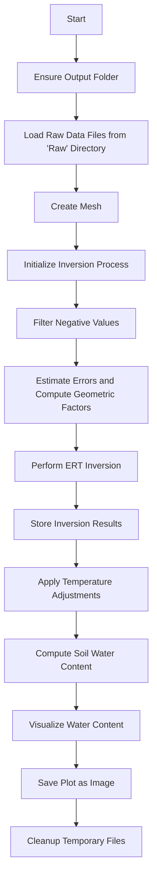
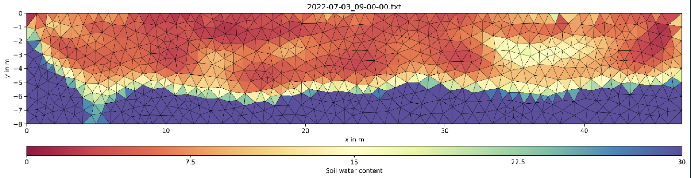

# Overview

This script computes the two-dimensional distribution of soil water content at a fixed temperature of 25 degrees Celsius. It uses Electrical Resistivity Tomography (ERT) data as input to calculate water content. The script processes raw data files, generates a geometric mesh for the study area, and performs inversion to obtain resistivity values. These values are then used to estimate soil water content, which is visualized and saved as an image.

# Workflow

#### 1. Setup Directorie:

Before any computation, the script checks whether an `Output` folder exists. If not, it creates one.

#### 2. Load Data:

The raw data files (in `.txt` format) are read from the `Raw` directory for processing.

#### 3. Mesh Creation:

- The `create_mesh()` function generates a geometric mesh from a defined 2D area.
- The mesh is used for inversion calculations and is saved in the `output` folder as `mesh.bms`.

#### 4. Inversion Process:

- The main function `watercomputing()` performs the inversion process.
- It iterates through each raw data file, performs `ERT` inversion, and stores the results.

#### 5. Water Content Computation:

- After the inversion, the script computes soil water content based on the resistivity results using a defined formula.
- Adjustments for temperature effects are also applied.

#### 6. Visualization:

The computed water content is visualized using `matplotlib` and saved as an image in the `Output` folder.

#### 7. Cleanup:

After all computations are complete, the `cleanup_temp_files()` function deletes temporary files created during the process.

# Function Explanation

- **`ensure_output_folder()`**: Checks if an `Output` folder exists. If it doesn't, creates a new one and returns the path to the `Output` folder.

- **`cleanup_temp_files()`**: Deletes temporary files matching predefined patterns (e.g., `.vector`, `.matrix`, `.bmat`, etc.). If any errors occur during deletion, it catches them and prints an error message.

- **`create_mesh(start, end, quality, area)`**: Creates a geometric mesh for the inversion process based on specified parameters. Saves the mesh to a file and returns the mesh object.

- **`watercomputing()`**: Manages the process of loading data, performing ERT inversion, calculating water content, and visualizing the results.
  **Parameters:**
  - `start`, `end`, `quality`, `area`: Used to generate the mesh.
  - `lam`: Regularization parameter for inversion.
  - `maxIter`: Maximum number of iterations for the inversion.
  - `dPhi`: Desired misfit change in percentage.
  - `A`, `B`: Constants used in the soil water content calculation.

# Display

#### Output Folder:

The script saves output plots in the `Output` directory. Each plot file is named according to the data file's name with an additional `Water_result` prefix.

#### Plotting:

After inversion, a plot of the result is generated using Matplotlib. The plot shows the resistivity data and is saved as a `.PNG` file.

# Conclusion

This script automates the process of calculating soil water content from ERT data. It manages file handling, mesh generation, inversion, and data visualization, while also ensuring temporary files are cleaned up. This makes the script efficient for analyzing soil moisture distributions.

# Reference

**GIMLi Development Team.** (n.d.). _MeshMethodManager.invert._ GIMLi - Geophysical Inversion and Modeling Library. Retrieved September 11, 2024, from [https://www.pygimli.org/\_modules/pygimli/frameworks/methodManager.html#MeshMethodManager.invert](https://www.pygimli.org/_modules/pygimli/frameworks/methodManager.html#MeshMethodManager.invert)

**GIMLi Development Team.** (n.d.). _Inversion._ GIMLi - Geophysical Inversion and Modeling Library. Retrieved September 11, 2024, from [https://www.pygimli.org/\_modules/pygimli/frameworks/inversion.html](https://www.pygimli.org/_modules/pygimli/frameworks/inversion.html)
