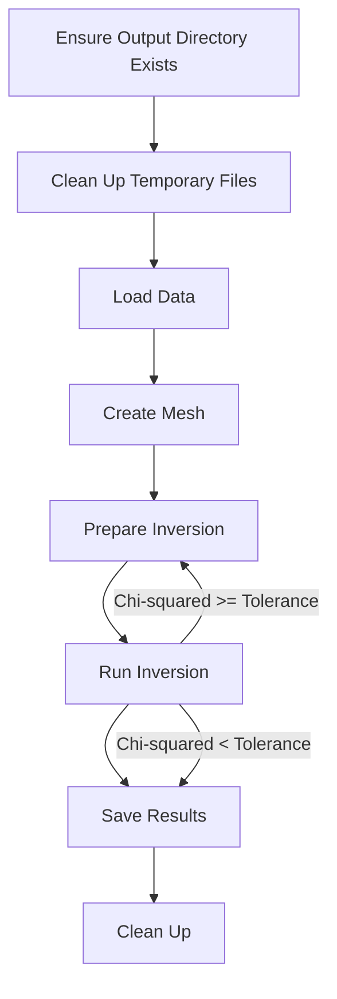
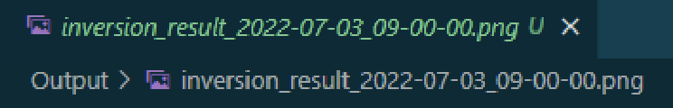
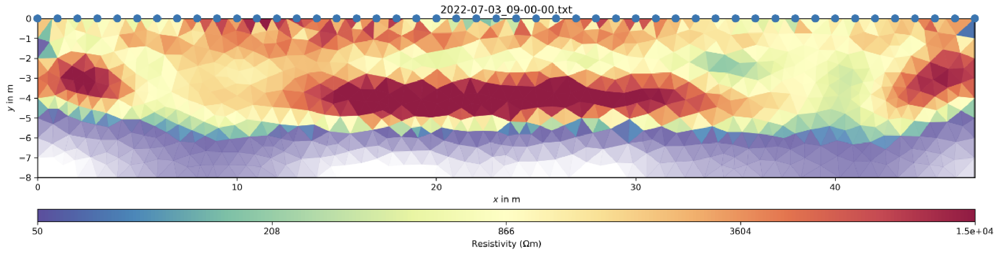

# Overview

This `ERT_Main.py` script performs Electrical Resistivity Tomography (ERT) inversion using the PyGimli library. It processes electrical data file (processed from data processing), creates a mesh, runs an inversion algorithm, and generates visual results in a figure. The script also manages temporary files and ensures that the output is properly saved.

# Workflow

#### 1. Setup Directories:

- Ensure that an output directory exists where results will be saved.
- Clean up any existing temporary files that match specific patterns.

#### 2. Load Data:

- Retrieve the first raw data file from the Raw directory.

#### 3. Create Mesh:

- Define a geometric region and generate a mesh for the inversion process.

#### 4. Prepare Inversion:

- Load the ERT data and preprocess it by filtering negative values and adding error estimates.

#### 5. Run Inversion:

- Perform the iteration of processing the inversion and calculate the chi-squared value.
- Check if it is lower than the set tolerance.

#### 6. Save Results:

- Store the inversion results and generate a plot showing the result.
- Save the plot as a `.PNG` file in the output directory.

#### 7. Clean Up:

- Remove temporary files that are no longer needed.

# Function Explanation

- **`ensure_output_folder()`**: Checks if an `Output` folder exists. If it doesn't, creates a new one and returns the path to the `Output` folder.

- **`cleanup_temp_files()`**: Deletes temporary files matching predefined patterns (e.g., `.vector`, `.matrix`, `.bmat`, etc.). If any errors occur during deletion, it catches them and prints an error message.

- **`get_first_raw_file()`**: Retrieves the first file from the `Raw` directory. Raises a `FileNotFoundError` if no files are found.

- **`create_mesh(start, end, quality, area)`**: Creates a geometric mesh for the inversion process based on specified parameters. Saves the mesh to a file and returns the mesh object.

- **`startInversion(maxIter, zWeight, lam, dPhi, start, end, quality, area)`**: Manages the entire ERT inversion process, including data loading, inversion parameter preparation, inversion execution, and result saving. It also generates and saves a plot of the inversion results.

# Display

#### Output Folder:

The script saves output plots in the `Output` directory. Each plot file is named according to the data file's name with an additional `inversion_result_` prefix.

#### Plotting:

After inversion, a plot of the result is generated using Matplotlib. The plot shows the resistivity data and is saved as a `.PNG` file.

# Conclusion

This script automates the process of performing ERT inversion and managing results. It ensures that output directories are created, temporary files are cleaned up, and results are visualized and saved. The provided functions are modular, allowing for easy adjustments to the inversion parameters or processing workflow.

# Reference

**GIMLi Development Team.** (n.d.). _MeshMethodManager.invert._ GIMLi - Geophysical Inversion and Modeling Library. Retrieved September 11, 2024, from [https://www.pygimli.org/\_modules/pygimli/frameworks/methodManager.html#MeshMethodManager.invert](https://www.pygimli.org/_modules/pygimli/frameworks/methodManager.html#MeshMethodManager.invert)

**GIMLi Development Team.** (n.d.). _Inversion._ GIMLi - Geophysical Inversion and Modeling Library. Retrieved September 11, 2024, from [https://www.pygimli.org/\_modules/pygimli/frameworks/inversion.html](https://www.pygimli.org/_modules/pygimli/frameworks/inversion.html)
