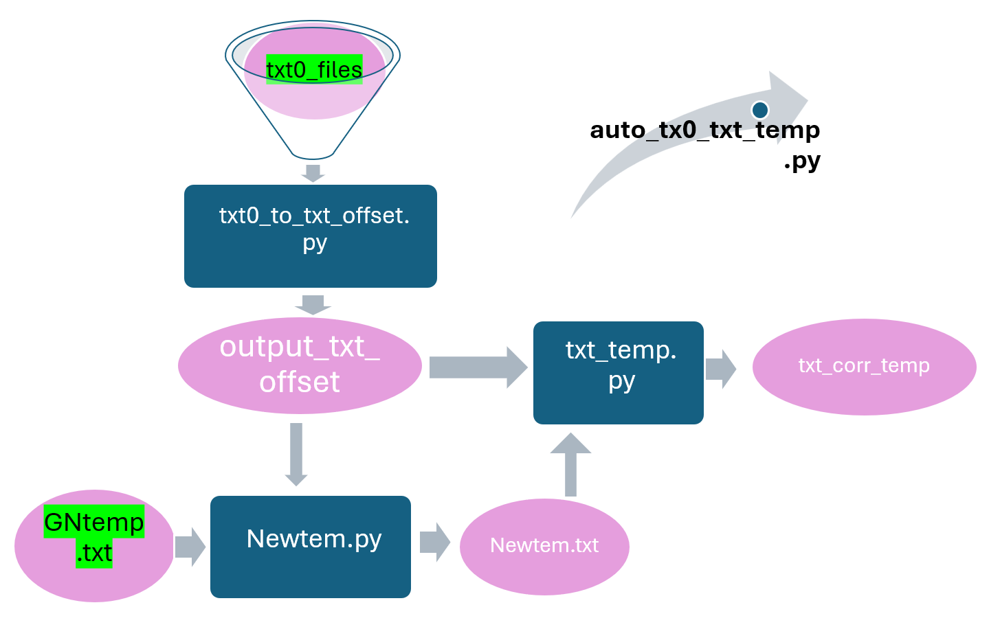

# User Manual

**For our client and team member to `better under` this block:**

## `Data Processing` Workflow for tx0_to_txt_temp Pipeline




### Step 1. Run ```tx0_to_txt_offset.py```

   - **Input**: `tx0_files` folder
   - **Output**: `output_txt_offset` folder

```python
python tx0_to_txt_offset.py tx0_files/ output_txt_offset/

```

### Step 2. Run ```Newtem.py```


   - **Input**: `output_txt_offset` folder and `GNtemp.txt` file
   - **Output**: `Newtem.txt` 

```python
python Newtem.py output_txt_offset/ GNtemp.txt

```


### Step 3. Run ```txt_temp.py```

   - **Input**: `output_txt_offset` folder and `Newtem.txt` file
   - **Output**: `tx0_to_txt_temp` folder

```python
python txt_temp.py Newtem.txt output_txt_offset/ 
```

### Step 4. Run ```auto_tx0_txt_temp.py``` to automate the above process.

   - **Input**: `tx0_files` folder and  `GNtemp.txt` file
   - **Output**: `tx0_to_txt_temp` folder

```python
python auto_tx0_txt_temp.py
```

## Note: Math formula 
**ρ_corrected = ρ_measured * [1 + α(T - T_ref)]**
Where:
ρ_corrected is the **corrected resistivity**
ρ_measured is the **measured resistivity**
α is the temperature **coefficient** (0.025 /°C in this formula)
T is the **actual** temperature
T_ref is the `reference` temperature (25°C in this formula)
The specific `formula` used in the code is:
ρ_corrected = ρ_measured * [1 + 0.025(T - 25)]

This formula accounts for the effect of temperature on resistivity, allowing the measured resistivity to be corrected to a standard temperature (25°C in this case). The temperature coefficient of 0.025 /°C indicates that for every 1°C deviation from the reference temperature, the resistivity changes by 2.5%.
